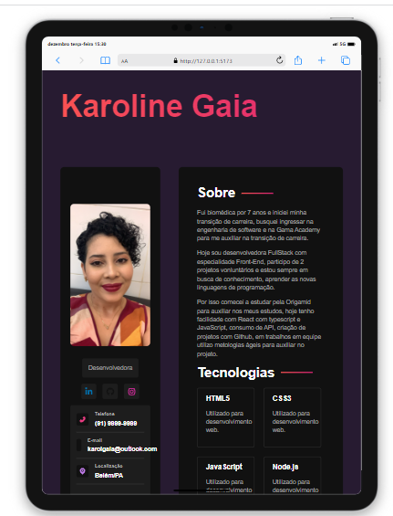

# Portfólio Karoline Gaia

Um projeto pessoal com intuito de criar meu portfólio com as principais linguagens de programação de desenvoldor Front-End

## Imagem

## Competências Desenvolvidas

- React
- SASS
- Components

## Deploy

Confira [_aqui o deploy_](https:///) do nosso projeto.

## Autores

